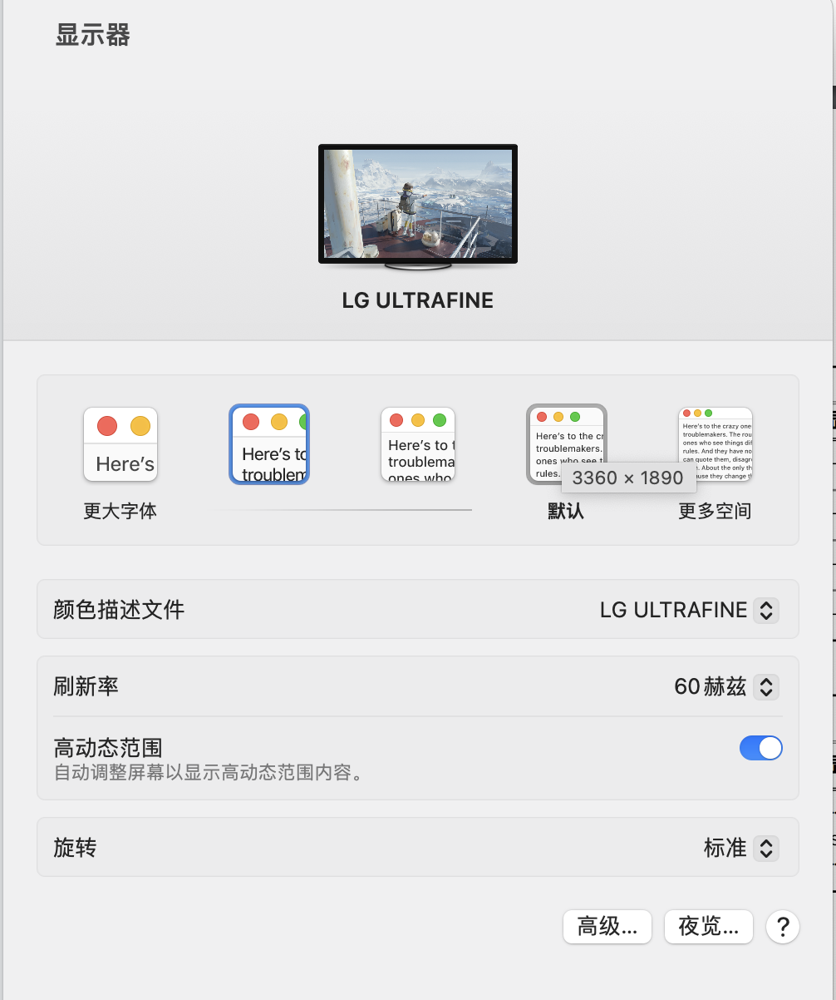

# DELL-G3-3590-Hackintosh-EFI

> Hackintosh EFI for Dell G3 3590

- 笔记本型号 [戴尔G3-3590](https://www.dell.com/support/home/zh-cn/product-support/product/g-series-15-3590-laptop/overview)

- OCC 版本0.8.7

### 硬件配置

除内存条更换外，其他配件均为原厂配件,苹果系统下独立显卡不可用

| 项目  | 配置                                       |
|-----|------------------------------------------|
| CPU | Intel(R) Core(TM) i7-9750H CPU @ 2.60GHz |
| 核显  | Intel UHD Graphics 630                   |
| 网卡  | Qualcomm QCA9377 (DW1820)                |

### 系统介绍

- Mac OS 13.0.1 (22A400)
- 模拟型号 MacBook Pro

| 项目       | 效果 |
|----------|----|
| 蓝牙       | ✅  |
| WI-FI    | ✅  |
| 以太网（有线网） | ✅  |
| 外接显示器    | ✅  | 
| 声音播放     | ✅  |
| 蓝牙耳机     | ✅  |
| 蓝牙耳机     | ✅  |
| iMessage | 🚫 |
| Facetime | 🚫 |
| 隔空投送等    | 🚫 |

### 外接显示器说明

根据[戴尔服务官网的说明](https://www.dell.com/support/manuals/zh-cn/g-series-15-3590-laptop/dell-g3-3590-setup-and-specifications/%e5%b7%a6%e4%be%a7?guid=guid-12cd14bb-8db3-47d7-a090-15d75787517a&lang=zh-cn)

HDMI接口输出的是独立显卡``NVIDIA GeForce GTX 1660 Ti``，TypeC接口输出的是``Intel UHD Graphics 630``

因此，外接显示器必须使用TypeC接口

本人实测：
DP 1.4（不能是1.2），步骤如下
1. 使用TypeC转DP1.4的数据线连接显示器（这个很好买）
2. 笔记本按下开机键后迅速合上盖子
3. 进入系统后设置显示器，即可正常4K 60Hz显示器输出

【重点】进入系统之前笔记本需要是盒盖状态，才可以实现60Hz

## 参考链接
- [国光的黑苹果安装教程：手把手教你配置 OpenCore](https://apple.sqlsec.com/)
- [OpenCore](https://github.com/dortania/OpenCore-Install-Guide)
- [macOS Ventura 13.0安装中常见的问题及解决方法
  ](https://blog.daliansky.net/Common-problems-and-solutions-in-macOS-Ventura-13.0-installation.html)
